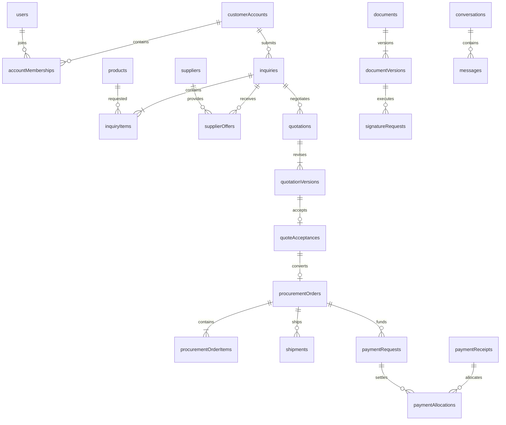

# B2B database model

Design only. Implement additive Convex validators, indexes and backfills before changing existing reads. All tables use Convex `_id` and `_creationTime`; timestamps below describe business events. Foreign keys are typed IDs, not free-text references.

## Relationship map

The quotation/order and receipt/allocation boundaries are deliberate. An accepted offer cannot silently inherit a newer catalog price; one verified receipt can be allocated to payment requests without being counted twice.

## Identity and catalog

| Table | Required business fields | Read indexes / constraints |
|---|---|---|
| `users` | Existing authentication identity, contact fields | Preserve Auth indexes and account linkage |
| `customerAccounts` | kind personal/business, displayName, country, city, address, businessType, optional tax identifiers, preferredContact, status, createdBy, updatedAt, revision | by_status; normalized search field/index for staff directory; account ownership checked via membership |
| `accountMemberships` | accountId, userId, role owner/buyer/viewer, status | by_account_user (application uniqueness); by_user_status; by_account_status |
| `staffMemberships` | userId, role, active, grantedBy, grantedAt | by_user_active; by_role_active; unique active user/role |
| `workAssignments` | resource discriminated union, staffUserId, assignedBy, assignedAt, active | by_staff_active; by_resource_active; validate role can perform assigned work |
| `categories` | slug, localized name/description, active, position | by_slug unique; by_active_position |
| `suppliers` | companyName, contact, location, categories, capacity description, lead time, customization capabilities, quality notes, status, createdBy, revision | by_status; by_name search; customer queries never expose this table directly |
| `products` additions | categoryId, MOQ, quantityIncrement, unitOfMeasure, indicativeCurrency, indicativeMin/Max minor units, productionMin/MaxDays, customizationAvailable, status draft/published/paused/archived, sourcingAvailability, publicSupplierSummary?, agentId?, reviewedAt?, updatedBy, revision | by_status_category; by_status_moq; by_status_customization; search indexes for localized names; retain legacy fields during migration |
| `productSpecifications` | productId, localized label/value, position, visibility public/internal | by_product_position |
| `productVariants` | productId, SKU/code, localized attributes, MOQ override?, increment override?, active, revision | by_product_active; by_product_code unique |
| `productPriceTiers` | productId, variantId?, minQuantity, indicative unitPriceMin/MaxMinor, currency, validAsOf | by_product_variant_quantity; ordered quantity breaks; one currency basis per schedule |
| `productMedia` | productId, kind image/video, storageId or approved publicURL, posterStorageId?, caption, position, publicationStatus | by_product_position; accepted file type and size; storage lifecycle managed |
| `productSupplierLinks` | productId, supplierId, primary, internal notes | by_product; by_supplier; internal access only |
| `savedProducts` | accountId, userId, productId | by_user_product unique; by_user_created; ensure active account membership |

Customization options and manufacturing information can start as bounded structured product fields: localized option name/description, available choices, material/manufacturing summary and shipping estimate/assumptions. Introduce child tables only when option editing or independent versions require them. Never invent values for legacy products; incomplete products remain drafts until reviewed.

## Sourcing and commercial records

| Table | Required business fields | Read indexes / constraints |
|---|---|---|
| `inquiries` | reference, accountId, createdBy, assignedTeam/User?, status, destination snapshot, desiredDate?, targetBudgetMinor/currency?, comments, submittedAt, updatedAt, revision | by_account_updated; by_status_updated; by_assignee_status; by_reference unique |
| `inquiryItems` | inquiryId, productId?, variantId?, product snapshot, desiredQuantity, customization, requirements | by_inquiry; enforce MOQ/increment for listed products; freeform sourcing request explicitly identified |
| `supplierOffers` | inquiryId, supplierId, createdBy, status, currency, validity, lead time, shipping assumptions, internal notes, revision | by_inquiry; by_supplier; by_creator_status; supplier price lines in bounded array or child items |
| `quotations` | reference, inquiryId, accountId, currentVersionId?, assignedTo, status, revision | by_inquiry; by_account_status; by_status_updated; by_reference unique |
| `quotationVersions` | quotationId, versionNumber, currency, line-item snapshots, freight/tax/fee lines, included/excluded/estimated basis, totals, paymentSchedule, production/shipping estimates, terms, requiredDocuments, expiresAt, createdBy, releasedBy?, releasedAt? | by_quote_version unique; released version immutable; version bounds for line items/attachments |
| `quoteAcceptances` | quotationId, versionId, accountId, actorId, acceptedAt, termsVersion/hash, idempotencyKey | by_quote unique accepted version; by_version; account authorization required |
| `procurementOrders` | reference, accountId, acceptedQuotationId, acceptedVersionId, acceptanceId, currency, agreedTotals snapshot, status, revision, expectedProductionAt?, confirmedBy, confirmedAt | by_acceptance unique; by_account_updated; by_status_updated; by_reference unique |
| `procurementOrderItems` | orderId, productId?, supplierId?, accepted product/variant/spec snapshot, quantity, unitPriceMinor, lineTotalMinor, customization | by_order; supplier access restricted by assignment; customer projection omits private supplier cost |
| `orderAmendments` | orderId, version, change summary, proposed terms, status, proposedBy, acceptedBy?, acceptedAt? | by_order_version; do not mutate original acceptance |
| `orderMilestones` | orderId, stage, status pending/active/complete/blocked, expectedAt?, completedAt?, publicNote, internalNote?, actorId | by_order_stage; ordered presentation; actual history in audit/domain events |
| `qualityInspections` | orderId, supplierId, inspectorId, outcome pending/pass/fail, findings, inspectedAt, documentIds, correctiveAction? | by_order; by_supplier; failed inspection blocks shipping absent audited exception |
| `shipments` | orderId, carrier?, trackingReference?, transportMode, origin, destination, quantities/lines, expectedAt?, status | by_order; by_tracking; partial shipments cannot exceed ordered quantities |
| `shipmentEvents` | shipmentId, status, location?, note, occurredAt, recordedBy, providerEventId? | by_shipment_occurred; deduplicate provider events |

Keep child collections bounded per write. An inquiry can contain multiple products, but the initial UI may submit one product; this avoids forcing every future multi-product request into unrelated quotations. Currency amounts are finite, nonnegative safe integers in minor units; rates use a documented fixed-precision representation. Reconcile line totals on the server and preserve the exchange-rate snapshot used for agreed conversions.

## Files, finance and coordination

| Table | Required business fields | Read indexes / constraints |
|---|---|---|
| `documents` | accountId?, resource link, kind, title, visibility customer/internal, currentVersionId, ownerId, status | by_resource; by_account_status; explicit resource authorization |
| `documentVersions` | documentId, version, storageId, originalFilename, MIME, bytes, contentHash, uploadedBy, uploadedAt, scanStatus | by_document_version unique; immutable bytes/metadata; release only after checks |
| `signatureRequests` | documentVersionId, accountId, signerUserId, purpose, method acknowledgement/provider, status, requestedBy, expiresAt | by_signer_status; by_document_version |
| `signatureEvidence` | requestId, actorId, versionHash, consentVersion, method, signedAt, provider/reference/evidenceStorageId? | by_request unique completion; never accept provider evidence from the browser as trusted |
| `paymentRequests` | orderId, accountId, milestone deposit/balance/other, amountMinor, currency, dueAt, status, issuedBy | by_order; by_account_status; by_status_due |
| `paymentAttempts` | requestId, provider, providerReference, idempotencyKey, expectedAmountMinor, currency, status, createdBy | by_provider_reference unique; by_request; no customer mutation can mark verified |
| `paymentReceipts` | provider manual/chapa/other, reference, actualAmountMinor, currency, receivedAt, verifiedAt?, verifiedBy?, status, evidenceDocumentId?, submittedBy | by_provider_reference unique; by_status_received; manual receipt has no self-verification |
| `paymentAllocations` | receiptId, requestId, amountMinor, createdBy, createdAt, reversalOf? | by_receipt; by_request; allocations <= verified receipt, same currency, corrections append reversals |
| `conversations` | resource link, accountId?, audience customer/internal/supplier_internal, status | by_resource_audience; by_account_updated |
| `conversationParticipants` | conversationId, userId, active | by_conversation_user unique; by_user_active |
| `messages` | conversationId, actorId, body, documentIds, createdAt, editedAt? | by_conversation_created; no unbounded transcript arrays |
| `supportRequests` | accountId, relatedResource?, kind callback/question, preferredChannel, summary, assignee?, status, requestedAt | by_account; by_assignee_status; by_status_requested |
| `communicationRecords` | relatedResource, actorId, channel, direction, occurredAt, summary, externalReference? | by_resource_occurred; log explicitly distinguishes sent externally vs recorded manually |
| `notifications` | recipientUserId, eventId, type, resource, safe summary, readAt? | by_recipient_created; by_recipient_read; event+recipient deduplication |
| `deliveryOutbox` | eventId, recipientId, channel, status, attempts, nextAttemptAt, providerReference?, lastErrorCode? | by_status_nextAttempt; by_event_recipient_channel unique logical delivery |
| `auditEvents` | actorId or system identity, action, resource, timestamp, safe before/after diff, requestId/idempotencyKey?, reason?, trusted device/IP metadata? | by_resource_time; by_actor_time; no passwords/tokens/full document contents |
| `metricRollups` | metric, period, dimensions, count/value, currency?, computedAt | by_metric_period_dimensions; reconcile against source records |

Resource links must be validator unions such as `{kind:'inquiry', inquiryId:Id<'inquiries'>}` rather than unchecked arbitrary strings. Every link checks account/resource consistency. A quote attachment belonging to another account must be rejected even if both IDs are valid.

## Query design and pagination

For each list, document the supported filter tuple before adding the query. Server-side filtering, sorting and cursor pagination apply to the full permitted dataset. The current “loaded records” filtering is transitional and does not meet this target.

Choose indexes around actual queues: customer account+status+updated time, staff assignee+status, supplier+status, published category+MOQ, and payment status+due time. Use text search indexes for supported language/name searches. When cross-table role filters are required, maintain a transactional directory projection (role set/contact verification) and backfill it; do not query every customer then join roles on the client. Avoid arbitrary expensive filter combinations until an appropriate index or bounded search strategy exists.

Public indicative prices in ETB can use a versioned read projection for range filtering. Recompute on published source-price/rate changes with clear rate version and as-of time; do not query mixed currencies as raw numbers. Accepted quote/order amounts never use this changing projection.

No unbounded collection scans for interactive pages, statistics or histories. Historical pagination must remain reachable; do not put pagination UI over a permanent `take(200)` cap. Authorize before reading private data and before issuing storage access.

## Audit and retention

Audit entries are append-only through domain mutations; offer no public edit/delete endpoint. Corrections create compensating events. Retention/deletion policy must distinguish authentication data, business records and evidence, with operational approval for policy changes. Do not label ordinary database records as tamper-proof; stronger evidence retention or external archival is a separate operational capability.
