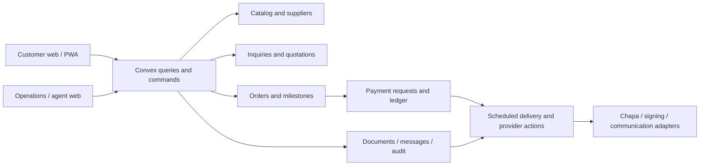

# B2B platform architecture

Status: target architecture; no live-schema migration performed.

## Boundaries and dependencies

Keep one Next.js application and one Convex backend. Customer, operations and China-agent route groups compose shared UI with different navigation and permissions. Business logic and access checks run on the backend; client capabilities only determine presentation.

Suggested backend modules: `catalog`, `suppliers`, `accounts`, `access`, `inquiries`, `quotations`, `procurement`, `finance`, `documents`, `conversations`, `notifications`, `audit`, `metrics`. Split growing modules by command/query family; avoid a generic workflow interpreter, new service layer process or parallel database. Shared pure validation and state-transition functions live under `convex/lib/`.

Queries expose explicit public/customer/staff projections, never whole records with private properties hidden only in React. Mutations validate inputs, load related records, authorize the actor, enforce invariants, commit changes and append audit/notification events together. Actions handle network I/O and invoke mutations for durable state. External delivery uses idempotent retries; provider failure never silently advances a transaction.

## Identity and authorization

Keep Convex Auth users as identities. An account represents a customer or business; memberships determine who can view or act for it. Every new personal customer gets a personal account and owner membership. Business profiles belong to accounts, not individual login credentials. Staff roles are separate from customer account memberships.

| Role | Scope | Allowed responsibilities | Explicit restrictions |
|---|---|---|---|
| Super Admin | Platform | Roles, settings, all operational administration | Cannot alter accepted terms or verified evidence without compensating events |
| Operations Admin | Platform operations | Assign work, publish products, approve/release quotes, confirm orders, oversee fulfillment | Cannot grant Super Admin or independently verify own payment submission |
| China Agent | Assigned suppliers/products/inquiries/orders | Supplier offers, product drafts, sourcing conversations, production/inspection updates, supplier documents | No staff roles, platform settings, customer-facing quote release or payment verification |
| Customer Support | Assigned customer work | Triage, clarify requirements, customer messages, callback requests, customer quote drafts | No private supplier cost by default, no publication/finance/role administration |
| Finance | Relevant platform transactions | Payment requests, evidence review, reconciliation, verification and reversals | No supplier/customer term editing or role grants |
| Customer / Business Customer | Own account memberships | Inquire, communicate, save, view disclosed documents, accept offers if authorized | No other accounts, private supplier records or internal notes |

Implement named permissions (for example `quotes.release`, `supplierOffers.read`, `payments.verify`) mapped to roles server-side. Permission checks also require resource scope: account membership, active assignment or explicitly authorized platform-wide access. Staff may hold multiple roles; audit the acting identity and permission. Account owners authorize accepting terms; viewers cannot accept quotations or sign.

Only Super Admin manages staff roles; prevent removing the last active Super Admin. Existing admins require an explicit migration decision, not automatic unrestricted promotion. A customer cannot become staff by editing profile fields. Customer-created account memberships require authorized invitation/acceptance, not arbitrary email claims.

## Workflow model

Separate sourcing, fulfillment, payment and document status. One long enum would incorrectly equate “paid” with “in production” or “signed” with “completed.” Compose these into the customer timeline.

| Aggregate | States and normal transitions | Guard |
|---|---|---|
| Inquiry | submitted → under_review → supplier_contacted → supplier_offer_received → quote_prepared → negotiation → accepted → converted | Assigned staff move operational states; quote state drives accepted/converted |
| Inquiry exceptions | needs_information, on_hold, declined, withdrawn | Reason required; closed requests do not accept new quotes |
| Customer quotation revision | draft → released → accepted; released → declined / expired / superseded | Only released, unexpired, latest eligible revision can be accepted by an authorized account member |
| Order | confirmed → production → inspection → shipping → customs → delivered → completed | Approved terms, required document/payment gates, authorized transition and timestamp |
| Order exceptions | on_hold, cancelled, rework | Reason and actor; inspection failure enters rework then inspection, not shipping |
| Payment request | draft → issued → partially_paid → paid; issued → overdue / cancelled | Verified allocations determine balances; cancelled requests cannot absorb new allocations |
| Payment evidence | submitted → under_review → verified / rejected | Finance verifies evidence, amount/currency/reference and receiver; submitter cannot self-verify |
| Document version | uploaded → scanning → available / rejected; available → superseded / withdrawn | Content immutable; required execution tracked separately |
| Signature request | requested → acknowledged or signed; requested → declined / expired | Exact document version and signer scope; provider-verified evidence for formal signing |

Order confirmation follows quote acceptance and staff validation of supply feasibility. Required signatures and deposit become explicit production gates, allowing payment requests to attach to a confirmed order before production begins. Different commercial arrangements may change required gates, but exceptions need Operations approval and an audit reason. Finance verifies payment; Operations approves the operational exception. Do not bypass payment verification with an arbitrary order status update.

Cancellation and refund are separate: cancelling an order does not claim that money was refunded. Revisions during negotiation create new offers; accepted quotes are frozen. Order changes require a versioned amendment and customer acceptance where commercial terms change.

## Transaction rules

- Quote acceptance checks account permission, currency, validity, current revision, quantities, explicit terms acknowledgement and prior acceptance in one mutation. Duplicate submissions return the existing acceptance.
- Convert an accepted quotation to exactly one procurement order using an indexed `acceptedQuotationId` lookup in the same mutation as insertion. Snapshot product, supplier, variant, price, exchange-rate basis and terms; catalog edits cannot change an order.
- Offer prices use currency plus integer minor-unit amounts. Quote shipping/tax/customs lines must state included, estimated or excluded; unknown freight is not displayed as zero or as a final total.
- Customer catalog prices are indicative ranges, with recorded basis and update date. Supplier costs, margins and internal offers remain private. Tier breaks are ordered and validated, and MOQ/increments are enforced on both client and server.
- Catalog quantity represents supplier MOQ/capacity, not retail warehouse inventory. Do not reserve `stock` for inquiries.
- Optimistic revisions reject stale updates with a refetch/review message. Status change and audit record commit together. Audit history is not a mutable array on the resource.

## Files, signatures and communications

Store private files as Convex storage IDs plus metadata. Authorize upload registration, read, download and version linkage against the transaction/account; validate size/type and isolate unscanned content. Do not reuse public product-photo URLs for contracts. A download endpoint rechecks access and streams private files; never put reusable private file URLs in public query payloads or offline caches. Public media publication requires explicit review and projection.

A signature record includes signer identity, document version/hash, purpose, consent text version, time, method and provider event/reference where applicable. A typed name or acknowledgement is labelled as acknowledgement, not advertised as a verified legal signature. Formal electronic-signature availability and evidence requirements remain an integration decision; signing a document never signs future revisions automatically.

Customer and internal conversations are separate threads with explicit participants. Internal supplier quotes/notes cannot appear in customer threads by toggling a display flag. External call/email/Telegram interaction records record channel, staff actor, time and summary without implying external message synchronization. Callback requests are assigned tasks.

## Payments and notifications

Keep Chapa behind provider-neutral payment commands: create payment request, initiate attempt, normalize provider event, verify externally and reconcile. Manual verification uses the same ledger allocation command after Finance review. Never reuse the existing retail webhook handler as a procurement status setter. Store provider plus provider reference/idempotency key so duplicate events cannot double-credit balances. Support deposits, balance requests and multiple partial payments; explicitly handle excess, wrong-currency and late receipts through a review queue.

Domain events create in-app notifications and delivery-outbox entries. Delivery records contain channel, attempts, retry time, status and provider ID; failures are visible and retryable. Start with in-app notifications. Enable email/Telegram/SMS/push independently when configured. Do not send business-document contents or sensitive supplier prices in notifications. Recipient access is rechecked when opening links.

## Metrics

Maintain bounded incremental counters/rollups or scheduled aggregates with reconciliation. Do not derive platform totals from the first loaded table page. Define active products as published and sourcing-available; active orders exclude cancelled/completed; production counts include rework only if labelled. Order value sums accepted commercial amounts by currency, or reports ETB using a disclosed snapshot basis. Inquiry conversion uses submitted cohorts and converted inquiries; document the period and denominator. Most-requested products use inquiry counts and quantities separately. Do not combine revenue collected with order value.
